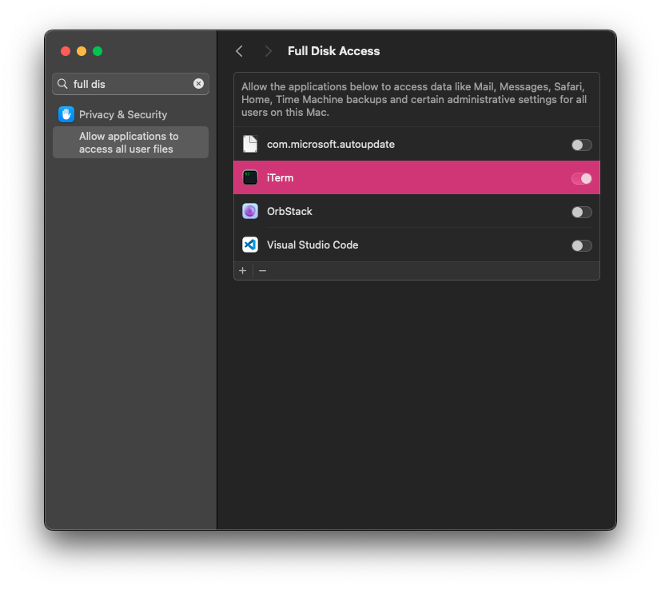

# ansible-macos

Just my standard system setup for macOS

## Usage

On a fresh Mac, execute the following:

Ensure the Terminal/iTerm has Full Disk Access else some settings will fail to Apply:



```shell
 # Install Xcode-CLT
$ xcode-select --install
# Install Homebrew
$ /bin/bash -c "$(curl -fsSL https://raw.githubusercontent.com/Homebrew/install/HEAD/install.sh)"
# Install Ansible
$ brew install ansible
# Run this playbook
$ ansible-playbook main.yaml
```

## TODO

- Manage Dock Icons once https://github.com/kcrawford/dockutil/pull/131 is merged
